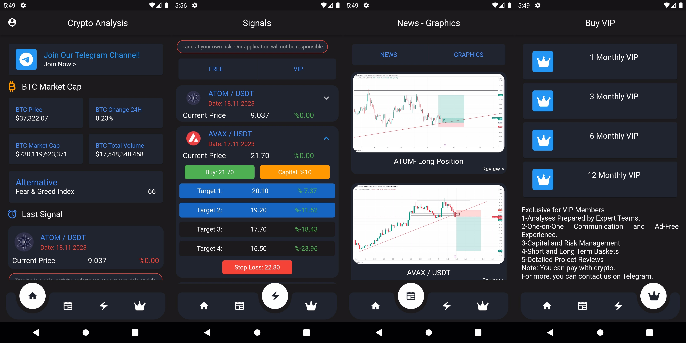

# crypto_analysis



This application allows you to view cryptocurrency analyses, access news, and analyze charts. Additionally, it provides notifications when shared cryptocurrency analyses reach specific targets.

## Technologies Used

- **Flutter**
- **Mobx**
- **Dio**
- **MVVM**
- **Firebase**
- **OneSignal**
- **In-app Purchase**

## Installation

1. Clone the application to your computer.
    ```bash
    git clone https://github.com/yigithanyaramis/crypto_analysis.git
    ```

2. Open the project and install dependencies.
    ```bash
    flutter pub get
    ```

3. Run the application.
    ```bash
    flutter run
    ```

For contributions or reporting issues, please contact via email: `yigithanyaramis@gmail.com`.